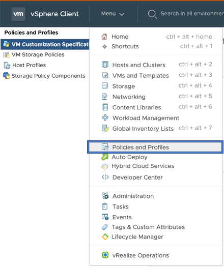

# E2E tests on Guest Cluster

## Configuring VCenter

### 1. Create namespace

#### Go to Workload Management

#### Click on Create Namespace and enter necessary inputs

### 2. Create a VM Storage Policy for shared datastore

#### Go to Policies and Profiles

#### Assign tag to a shared datastore

#### Create tag based Storage Policy using the tag created in previous step

### 3. Create a VM Storage Policy for local datastore

#### Assign tag to a local datastore

#### Create tag based Storage Policy using the tag created in previous step for local datastore

## Running e2e Tests

The section outlines how to set the env variable for running e2e test.

### Building e2eTest.conf

    [Global]
    insecure-flag = "true"
    hostname = "<VC_IP>"
    user = "<USER>"
    password = "<PASSWORD>"
    port = "443"
    datacenters = "<Datacenter_Name>"

* Please update the `hostname` and `datacenters` as per your testbed configuration.
datacenters should be comma separated if deployed on multi-datacenters

### Copy contents of ~/.kube/config from Guest Cluster master node to your e2e test environment

    cat ~/.kube/config
    #PASTE CONTENTS OF ~/.kube/config FROM GUEST CLUSTER MASTER NODE>

### Copy contents of ~/.kube/config from Supervisor Cluster master node to your e2e test environment

    cat /path/to/supervisor-cluster-kube-config-file
    #PASTE CONTENTS OF ~/.kube/config FROM SUPERVISOR CLUSTER MASTER NODE>

### Setting env variables

    # Setting env variables for non-zone e2e tests
    export E2E_TEST_CONF_FILE="/path/to/e2eTest.conf"
    export KUBECONFIG=~/.kube/config
    export SUPERVISOR_CLUSTER_KUBE_CONFIG=/path/to/supervisor-cluster-kube-config-file
    export SHARED_VSPHERE_DATASTORE_URL="ds:///vmfs/volumes/5cf05d97-4aac6e02-2940-02003e89d50e/"
    export NONSHARED_VSPHERE_DATASTORE_URL="ds:///vmfs/volumes/5cf05d98-b2c43515-d903-02003e89d50e/"
    export STORAGE_POLICY_FOR_SHARED_DATASTORES="shared-ds-policy"
    export STORAGE_POLICY_FOR_NONSHARED_DATASTORES="non-shared-ds-policy"
    export CLUSTER_FLAVOR="GUEST_CLUSTER"
    export GINKGO_FOCUS="csi-guest"
    export SVC_NAMESPACE="test-gc-e2e-demo-ns"

## Requirements

Go version: 1.13

Export the go binary in your PATH to run end-to-end tests

    echo $PATH
    <path-1>:<path-2>:...:/Users/<user-name>/go/bin/

### Run e2e tests

    make test-e2e

### Running specific e2e test

To run a particular e2e test, set GINKGO_FOCUS to the string located “ginkgo.It()” for that test:

To run the Disk Size test (located at /tests/e2e/vsphere_volume_disksize.go

    export GINKGO_FOCUS="Volume\sDisk\sSize"

Note that specify spaces using “\s”.
