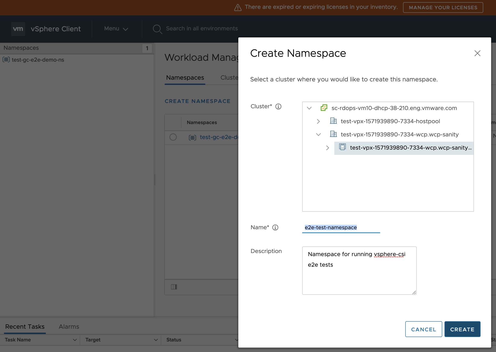
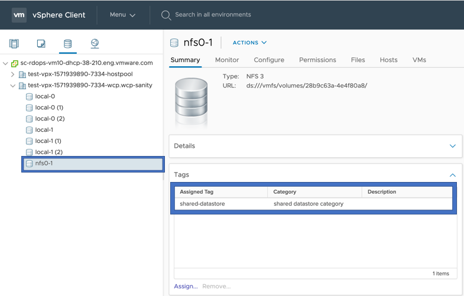
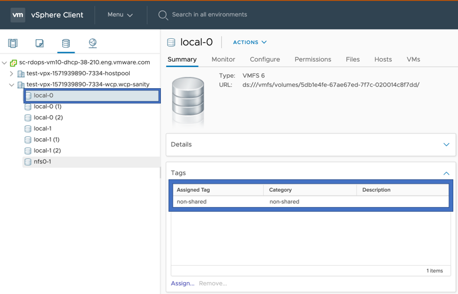

# E2E tests on Supervisor Cluster

## Configuring VCenter

### 1. Create namespace

#### Create two namespaces "e2e-test-namespace" and "e2e-namespace-to-delete"

#### Go to Workload Management

#### Click on Create Namespace and enter necessary inputs

### 2. Create a VM Storage Policy for shared datastore

#### Go to Policies and Profiles

#### Assign tag to a shared datastore

#### Create tag based Storage Policy using the tag created in previous step

### 3. Create a VM Storage Policy for local datastore

#### Assign tag to a local datastore

#### Create tag based Storage Policy using the tag created in previous step for local datastore

### Fetch the shared-vsphere-datastore-url from VC

## Running e2e Tests

The section outlines how to set the env variable for running e2e test.

### Building e2eTest.conf

    [Global]
    insecure-flag = "true"
    hostname = "<VC_IP>"
    user = "<USER>"
    password = "<PASSWORD>"
    port = "443"
    datacenters = "<Datacenter_Name>"

* Please update the `hostname` and `datacenters` as per your testbed configuration.
datacenters should be comma separated if deployed on multi-datacenters

### Copy contents of ~/.kube/config from Supervisor Cluster master node to your e2e test environment

    cat ~/.kube/config
    #PASTE CONTENTS OF ~/.kube/config FROM SUPERVISOR CLUSTER MASTER NODE>

### Setting env variables

    # Setting env variables for non-zone e2e tests
    export E2E_TEST_CONF_FILE="/path/to/e2eTest.conf"
    export KUBECONFIG=~/.kube/config
    export STORAGE_POLICY_FOR_SHARED_DATASTORES="shared-ds-policy"
    # Another shared datastore policy used in a static provisioning testcase
    export STORAGE_POLICY_FOR_SHARED_DATASTORES_2="shared-ds-policy-2"
    export STORAGE_POLICY_FOR_NONSHARED_DATASTORES="non-shared-ds-policy"
    # For few SVC block volume expansion tests we need a storage policy which has thick provisioning enabled
    export STORAGE_POLICY_WITH_THICK_PROVISIONING="<policy-name>"
    # Make sure env var FULL_SYNC_WAIT_TIME should be at least double of the manifest variable FULL_SYNC_INTERVAL_MINUTES in csi-driver-deploy.yaml
    export FULL_SYNC_WAIT_TIME=350    # In seconds
    export USER=root
    export CLUSTER_FLAVOR="WORKLOAD"
    export GINKGO_FOCUS="csi-supervisor"
    export SVC_NAMESPACE="e2e-test-namespace"
    #Create a namespace with the name e2e-namespace-to-delete
    export SVC_NAMESPACE_TO_DELETE="e2e-namespace-to-delete"
    # Set the SHARED_VSPHERE_DATASTORE_URL to the url fetched from the Vcenter as mentioned in the steps above
    export SHARED_VSPHERE_DATASTORE_URL="<shared-vsphere-datastore-url>"
    # Set the NONSHARED_VSPHERE_DATASTORE_URL to the url fetched from the Vcenter as mentioned in the steps above
    export NONSHARED_VSPHERE_DATASTORE_URL="<non-shared-vsphere-datastore-url>"
    # Set this variable to run static provisioning VMDK test cases.
    export DISK_URL_PATH="https://<VC_IP>/folder/<vmName>/<vmName_1.vmdk>?dcPath=<DatacenterPath>&dsName=<dataStoreName>"
    export COMPUTE_CLUSTER_NAME="<your_cluster_name>"
    #shared VVOL datastore url
    export SHARED_VVOL_DATASTORE_URL="<shared-VVOL-datastore-url>"
    #shared NFS datastore url
    export SHARED_NFS_DATASTORE_URL="<shared-NFS-datastore-url>"
    #shared VMFS datastore url
    export SHARED_VMFS_DATASTORE_URL="<shared-VMFS-datastore-url>"
    #For vsan direct tests for spbm policy driven allocation tests, set following variables
    export USE_VSAN_DIRECT_DATASTORE_IN_WCP="VSAN_DIRECT"
    export SHARED_VSAND_DATASTORE_URL="<vsan-direct-datastore-url>"
    export SHARED_VSAND_DATASTORE2_URL="<vsan-direct-datastore2-url>"
    export BUSYBOX_IMAGE="<image-used-to-deploy-pods>"
    # Need this for dcli, REST APIs and govc
    export VC_ADMIN_PWD="<password>"

### To run full sync test, need do extra following steps

#### Setting SSH keys for VC with your local machine to run full sync test

    1.ssh-keygen -t rsa (ignore if you already have public key in the local env)
    2.ssh root@vcip mkdir -p .ssh
    3.cat ~/.ssh/id_rsa.pub | ssh root@vcip 'cat >> .ssh/authorized_keys'
    4.ssh root@vcip "chmod 700 .ssh; chmod 640 .ssh/authorized_keys"

### To run VMservice with pvc tests need to do extra steps mentioned below along passwordless login for VC

    export CONTENT_LIB_URL="<url>"
    # Similar to cd:42:47:26:...:7e:24:e1:39
    export CONTENT_LIB_THUMBPRINT="<thumbprint>"
    export VMSVC_IMAGE_NAME="<name of image to use>"
    export GATEWAY_VM_IP=<gateway vm ip>
    # Gateway/bastion/jump host credentials
    export GATEWAY_VM_USER=<user>
    export GATEWAY_VM_PASSWD=<passwd>

## Requirements

Go version: 1.21

Export the go binary in your PATH to run end-to-end tests

    echo $PATH
    <path-1>:<path-2>:...:/Users/<user-name>/go/bin/

### Run e2e tests

    make test-e2e

### Running specific e2e test

To run a particular e2e test, set GINKGO_FOCUS to the string located “ginkgo.It()” for that test:

To run the Disk Size test (located at tests/e2e/vsphere_volume_disksize.go)

    export GINKGO_FOCUS="Volume\sDisk\sSize"

Note that specify spaces using “\s”.
