# Topology aware E2E tests on Vanilla k8s

## Configuring VCenter

### 1. Setup a datacenter with 3 clusters

      i. Cluster-1 can have 2 or more kubernetes node VMs
     ii. Cluster-2 must have atleast 2 kubernetes node VMs
    iii. Cluster-3 must have only 1 kubernetes node VM

#### Topological view of the datacenter

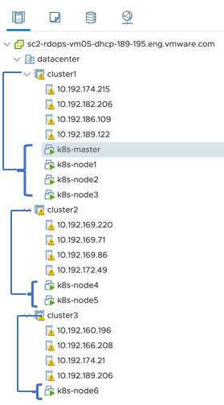

### 2. Create and assign tags to clusters and nodes

#### Assign tag region-1 to Cluster-1

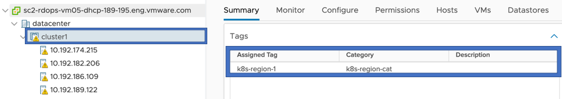

#### Assign tag zone-1 to all nodes in Cluster-1

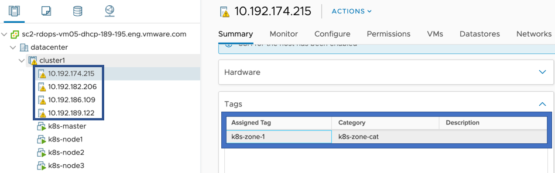

#### Assign tag region-2 to Cluster-2

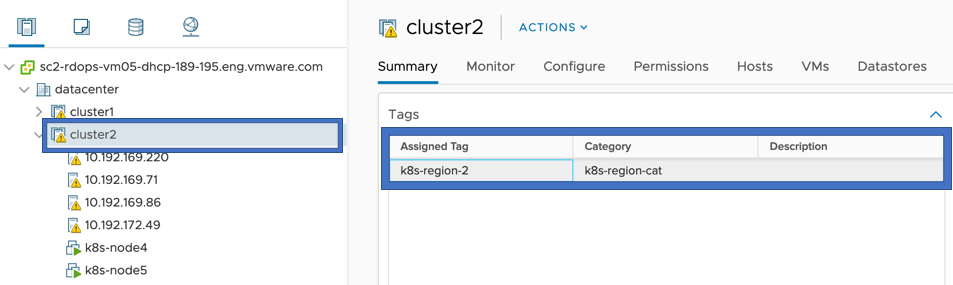

#### Assign tag zone-2 to all nodes in Cluster-2

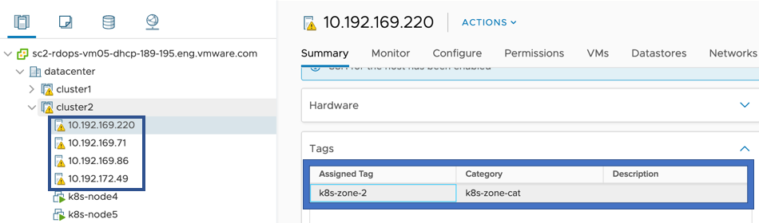

#### Assign tag region-3 to Cluster-3

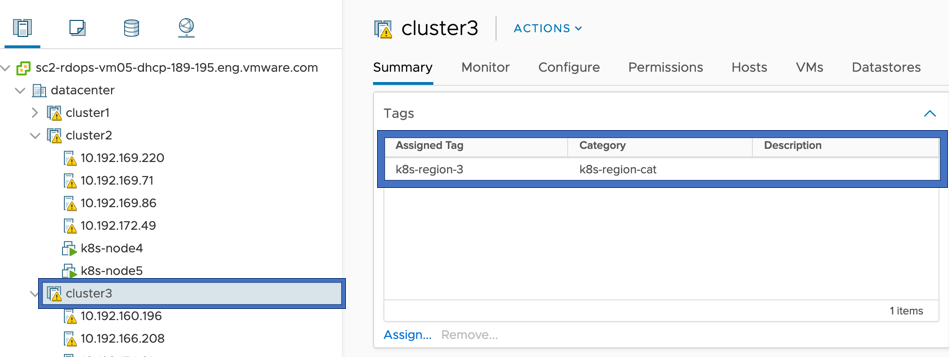

#### Assign tag zone-3 to all nodes in Cluster-3

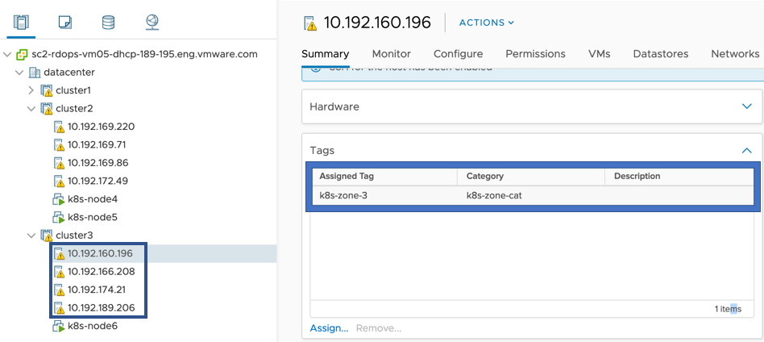

### 3. Create a VM Storage Policy for local datastore in Cluster-1 (region-1)

#### Assign tag to local datastore

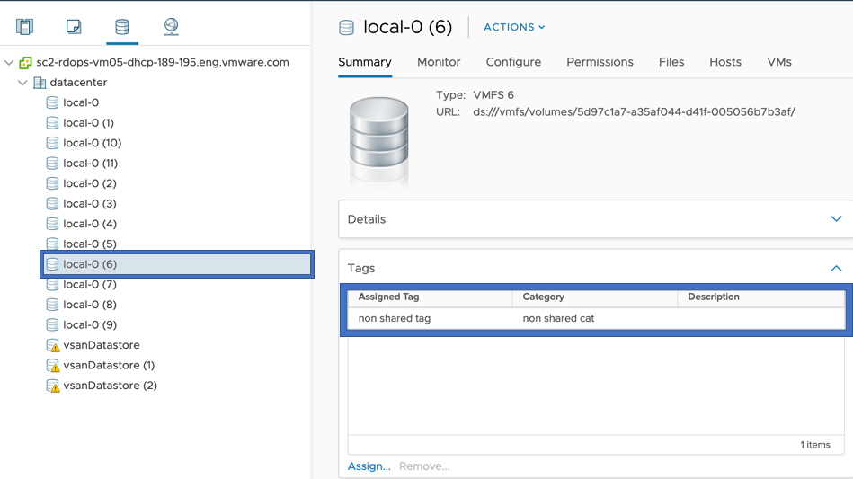

#### Create tag based Storage Policy using the tag created in previous step

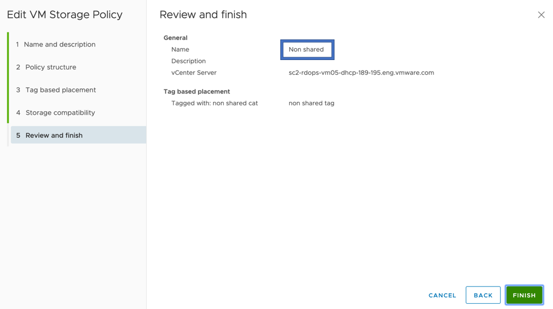

### 4. Create a VM Storage Policy for shared datastore in Cluster-2

#### Assign tag to shared datastore in Cluster-2

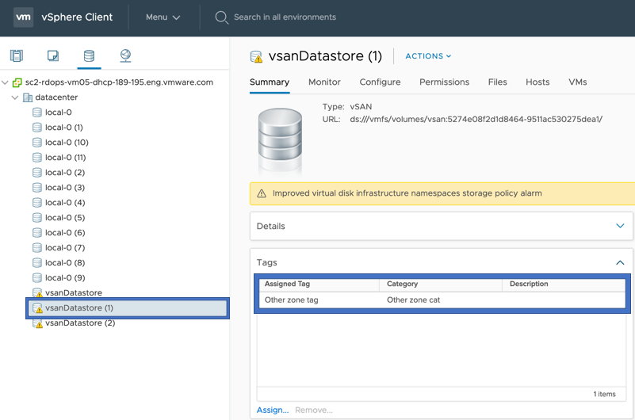

#### Create tag based Storage Policy using the tag created in previous step for local datastore

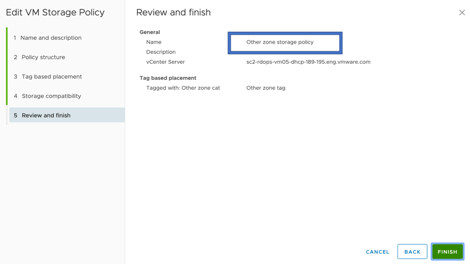

## Running e2e Tests

The section outlines how to set the env variable for running e2e test.

## Building e2eTest.conf

    [Global]
    insecure-flag = "true"
    hostname = "<VC_IP>"
    user = "<USER>"
    password = "<PASSWORD>"
    port = "443"
    datacenters = "<Datacenter_Name>"

* Please update the `hostname` and `datacenters` as per your testbed configuration.
datacenters should be comma separated if deployed on multi-datacenters

## Copy contents of ~/.kube/config from master node to your e2e test environment

    cat ~/.kube/config
    #PASTE CONTENTS OF ~/.kube/config FROM KUBERNETES MASTER NODE>

## Setting env variables

### For Vanilla Cluster Topology tests

    # Setting env variables for non-zone e2e tests
    export E2E_TEST_CONF_FILE="/path/to/e2eTest.conf"
    export KUBECONFIG=~/.kube/config
    export SHARED_VSPHERE_DATASTORE_URL="ds:///vmfs/volumes/5cf05d97-4aac6e02-2940-02003e89d50e/"  # Region-1 shared datastore URL
    export NONSHARED_VSPHERE_DATASTORE_URL="ds:///vmfs/volumes/5cf05d98-b2c43515-d903-02003e89d50e/" # Region-1 local datastore URL
    export STORAGE_POLICY_FOR_SHARED_DATASTORES="vSAN Default Storage Policy" # Region-1 shared datastore storage policy
    export STORAGE_POLICY_FOR_NONSHARED_DATASTORES="non-shared-ds-policy" # Region-1 local datastore storage policy
    export CLUSTER_FLAVOR="VANILLA"
    export GINKGO_FOCUS="csi-topology-vanilla"
    # Region and zone tag value where all worker node VMs have a shared datastore
    export TOPOLOGY_WITH_SHARED_DATASTORE="<region-1-shared-datastore>:<zone-1-with-shared-datastore>"
    # Region and zone tag value where worker node VMs do not have a shared datastore
    export TOPOLOGY_WITH_NO_SHARED_DATASTORE="<region-2-without-shared-datastore>:<zone-2-without-shared-datastore>"
    # Region and zone tag value with only one worker node VM
    export TOPOLOGY_WITH_ONLY_ONE_NODE="<region-3-with-only-one-node>:<zone-3-with-only-one-node>"
    # Storage policy from the region/zone where worker node VMs do not have a shared datastore
    export STORAGE_POLICY_FROM_INACCESSIBLE_ZONE="Region-2-shared-datastore-storage-policy"
    # Datastore URL from the region/zone where worker node VMs do not have a shared datastore
    export INACCESSIBLE_ZONE_VSPHERE_DATASTORE_URL="Region-2-shared-datastore-storage-url"
    export BUSYBOX_IMAGE="<image-used-to-deploy-pods>"
    # Need this for dcli, REST APIs and govc
    export VC_ADMIN_PWD="<password>"

## Requirements

Go version: 1.20

Export the go binary in your PATH to run end-to-end tests

    echo $PATH
    <path-1>:<path-2>:...:/Users/<user-name>/go/bin/

### Run e2e tests

    make test-e2e

### Running specific e2e test

To run a particular e2e test, set GINKGO_FOCUS to the string located “ginkgo.It()” for that test:

To run the Disk Size test (located at tests/e2e/vsphere_volume_disksize.go)

    export GINKGO_FOCUS="Volume\sDisk\sSize"

Note that specify spaces using “\s”.
