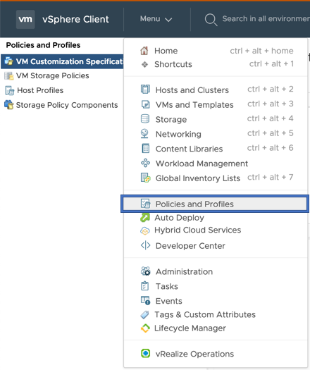
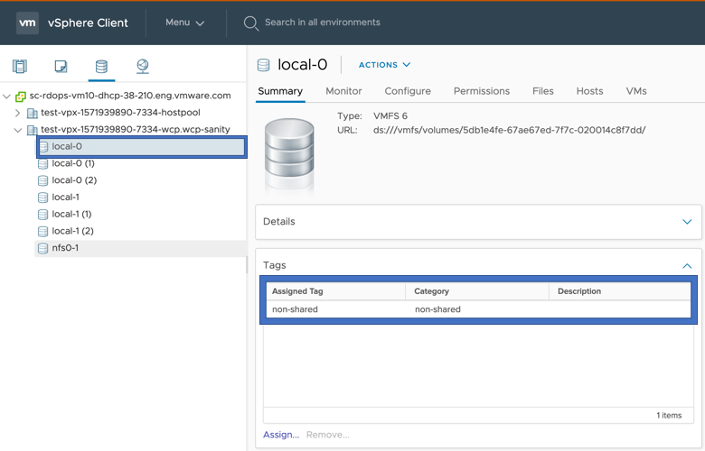
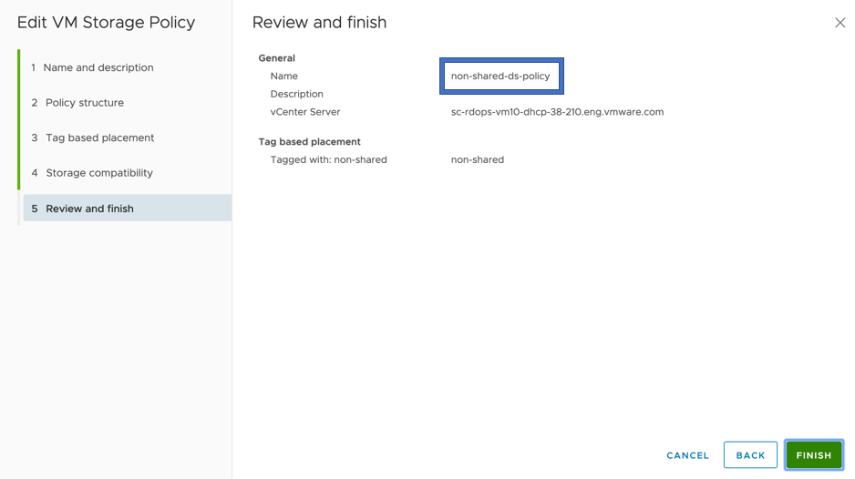

# E2E tests on Vanilla k8s

## Configuring VCenter

### Create a VM Storage Policy for local datastore

#### Assign a tag to local datastore

#### Create a tag based storage policy for a local datastore

## Running e2e Tests

The section outlines how to set the env variable for running e2e test.

### Building e2eTest.conf

    [Global]
    insecure-flag = "true"
    cluster-id = "<cluster-id>"
    hostname = "<VC_IP>"
    user = "<USER>"
    password = "<PASSWORD>"
    port = "443"
    datacenters = "<Datacenter_Name>"
    targetvSANFileShareDatastoreURLs = "<comma separated datastore URLs>" # Optional parameter

* Please update the `hostname` and `datacenters` as per your testbed configuration.
`datacenters` should be comma separated if deployed on multi-datacenters
* `targetvSANFileShareDatastoreURLs` is an optional parameter. It contains a comma separated
list of datastore URLs where you want to deploy file share volumes. Retrieve this value from the
 secret named `vsphere-config-secret` in your testbed.
* `cluster-id` field is optional for block vanilla tests but required for file vanilla static provisioning tests.
`cluster-id` is name of the cluster as seen in VC.

### Copy contents of ~/.kube/config from master node to your e2e test environment

    cat ~/.kube/config
    #PASTE CONTENTS OF ~/.kube/config FROM KUBERNETES MASTER NODE>

### Setting env variables

    # Setting env variables for non-zone e2e tests
    export E2E_TEST_CONF_FILE="/path/to/e2eTest.conf"
    export KUBECONFIG=~/.kube/config
    export VOLUME_OPS_SCALE=5
    export SHARED_VSPHERE_DATASTORE_URL="ds:///vmfs/volumes/5cf05d97-4aac6e02-2940-02003e89d50e/"
    export NONSHARED_VSPHERE_DATASTORE_URL="ds:///vmfs/volumes/5cf05d98-b2c43515-d903-02003e89d50e/"
    export DESTINATION_VSPHERE_DATASTORE_URL="ds:///vmfs/volumes/5ad05d98-c2d43415-a903-12003e89d50e/" # Any local datastore url
    export SHARED_VVOL_DATASTORE_URL="ds:///vmfs/volumes/vvol:5c5ddeccfb2f476c-ac17f22d228af0f1/" #shared VVOL datastore url
    export SHARED_NFS_DATASTORE_URL="ds:///vmfs/volumes/fb4efbd8-6e969410/" #shared NFS datastore url
    export SHARED_VMFS_DATASTORE_URL="ds:///vmfs/volumes/6009698f-424076e2-c60d-02008c6fa7e4/" #shared VMFS datastore url
    export STORAGE_POLICY_FOR_SHARED_DATASTORES="vSAN Default Storage Policy"
    export STORAGE_POLICY_FOR_NONSHARED_DATASTORES="non-shared-ds-policy"
    # Make sure env var FULL_SYNC_WAIT_TIME should be at least double of the manifest variable FULL_SYNC_INTERVAL_MINUTES in csi-driver-deploy.yaml
    export FULL_SYNC_WAIT_TIME=350    # In seconds
    export USER=root
    # Set VC,VC UI,ESX and K8S VM password accordingly
    export NIMBUS_K8S_VM_PWD=<k8s-vm-password>
    export ESX_PWD=<esx-password>
    export VC_PWD=<vc-password>
    export VC_ADMIN_PWD=<vc-ui-password>
    export CLUSTER_FLAVOR="VANILLA"
    export CSI_NAMESPACE="vmware-system-csi"
    # To run e2e test for block volume, need to set the following env variable
    export GINKGO_FOCUS="csi-block-vanilla"
    # To run e2e test for file volume, need to set the following env variable
    export GINKGO_FOCUS="csi-file-vanilla"

    # Optional size to use while creating large PVCs, defaults to 50Gi
    export LARGE_DISK_SIZE="100Gi"

    # For VCP to CSI migration tests following are needed as well
    export SHARED_VSPHERE_DATASTORE_NAME="vsanDatastore"
    export ESX_TEST_HOST_IP="<esx_host_ip>"  # for static provisioning tests
    # SHARED_VSPHERE_DATASTORE_NAME and SHARED_VSPHERE_DATASTORE_URL should correspond to same shared datastore
    # To run e2e test for VCP to CSI migration, need to set the following env variable
    export GINKGO_FOCUS="csi-vcp-mig"

    # For vsan stretched cluster tests
    export TESTBEDINFO_JSON="/path/to/nimbus_testbedinfo.json"
    export GINKGO_FOCUS="vsan-stretch-vanilla"

    # To run common e2e tests (block & file), need to set the following env variable to identify the file volume setup
    export ACCESS_MODE="RWX"

    # If CSI controller is running on a different k8s cluster, we need to pass the kubeconfig for that cluster using
    export CONTROLLER_CLUSTER_KUBECONFIG="/path/to/remote/kubeconfig"

### To run full sync test, need do extra following steps

#### Setting SSH keys for VC with your local machine to run full sync test

    1.ssh-keygen -t rsa (ignore if you already have public key in the local env)
    2.ssh root@<vc-ip-address> mkdir -p .ssh
    3.cat ~/.ssh/id_rsa.pub | ssh root@<vc-ip-address> 'cat >> .ssh/authorized_keys'
    4.ssh root@<vc-ip-address> "chmod 700 .ssh; chmod 640 .ssh/authorized_keys"

#### Setting SSH keys for ESX with your local machine to run VCP to CSI migration static provisioning tests

    1.ssh-keygen -t rsa (ignore if you already have public key in the local env)
    2.cat ~/.ssh/id_rsa.pub | ssh root@<esx-ip-address> 'cat >> /etc/ssh/keys-root/authorized_keys'
    3.ssh root@<esx-ip-address> "chmod 640 /etc/ssh/keys-root/authorized_keys"

## Requirements

Go version: 1.13

Export the go binary in your PATH to run end-to-end tests

    echo $PATH
    <path-1>:<path-2>:...:/Users/<user-name>/go/bin/

### Run e2e tests

    make test-e2e

### Running specific e2e test

To run a particular e2e test, set GINKGO_FOCUS to the string located “ginkgo.It()” for that test:

To run the Disk Size test (located at tests/e2e/vsphere_volume_disksize.go)

    export GINKGO_FOCUS="Volume\sDisk\sSize"

Note that specify spaces using “\s”.
