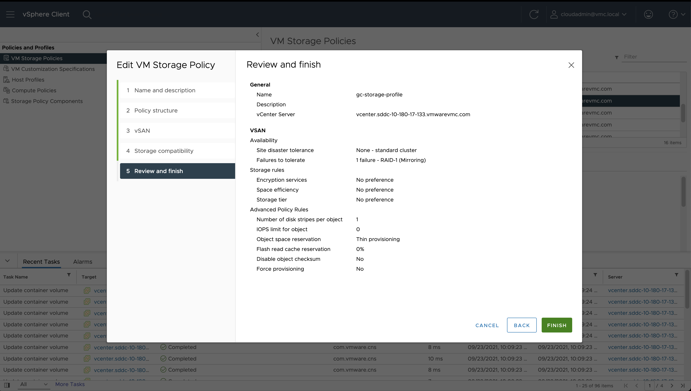
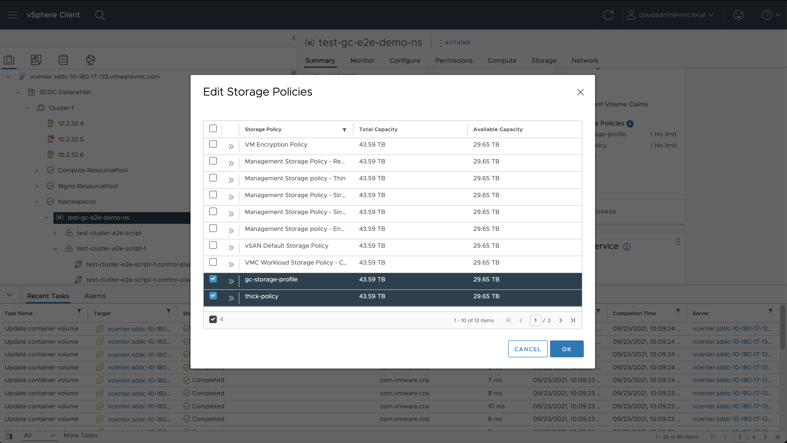

# E2E Tests on VMC GC environment

## Configuring VCenter

### 1. Create namespace

#### Go to Workload Management

#### Click on Create Namespace and enter necessary inputs

### 2. Create a VM Storage Policy and assign it to the namespace created above

#### Assign storage policy to the namespace

## Running e2e Tests from the pop machine

The section outlines how to set the env variable for running the e2e test.

### Building e2eTest.conf

    [Global]
    insecure-flag = "true"
    hostname = "<VC_IP>"
    user = "<USER>"
    password = "<PASSWORD>"
    port = "443"
    vmc-devopsuser = "<DEVOPS_USER>"
    vmc-devopspassword = "<PASSWORD>"
    vmc-cloudadminuser = "<CLOUD_USER>"
    cloudadminpassword = "<PASSWORD>"
    datacenters = "<Datacenter_Name>" # Optional parameter

- Please update the e2eTest.conf as per your testbed configuration.

### Setting env variables

    # Setting env variables for non-zone e2e tests
    export E2E_TEST_CONF_FILE="/path/to/e2eTest.conf"
    export KUBECONFIG=~/.kube/config
    export SUPERVISOR_CLUSTER_KUBE_CONFIG=/path/to/supervisor-cluster-kube-config-file
    export SHARED_VSPHERE_DATASTORE_URL="<SHARED_DATASTORE_URL>"
    export STORAGE_POLICY_FOR_SHARED_DATASTORES="shared-ds-policy"
    export CLUSTER_FLAVOR="GUEST_CLUSTER"
    export GINKGO_FOCUS="vmc"
    export SVC_NAMESPACE="test-gc-e2e-demo-ns"
    export VMC_USER="testuser"
    export TKG_UPGRADE_IMAGE="<TKG_IMAGE>"
    export TKG_CLUSTER_FOR_UPGRADE="<TKG_CLUSTER_FOR_UPGRADE>"
    # Make sure env var FULL_SYNC_WAIT_TIME should be at least double of the manifest variable FULL_SYNC_INTERVAL_MINUTES in pvcsi.yaml
    export FULL_SYNC_WAIT_TIME=350    # In seconds
    export NEW_GUEST_CLUSTER_KUBE_CONFIG=/path/to/second-guest-cluster-kube-config-file
    export DELETE_GUEST_CLUSTER_KUBE_CONFIG=/path/to/kube-config-file-of-guest-cluster-to-be-deleted
    export TKG_CLUSTER_TO_DELETE="<TKG_CLUSTER_TO_DELETE>"
    export STORAGE_POLICY_WITH_THICK_PROVISIONING="<policy-name>"
    export COMPUTE_CLUSTER_NAME="<your_cluster_name>"
    export RAID_0_STORAGE_POLICY="raid-0-policy"
    #shared VVOL datastore url
    export SHARED_VVOL_DATASTORE_URL="<shared-VVOL-datastore-url>"
    #shared NFS datastore url
    export SHARED_NFS_DATASTORE_URL="<shared-NFS-datastore-url>"
    #shared VMFS datastore url
    export SHARED_VMFS_DATASTORE_URL="<shared-VMFS-datastore-url>"
    #management datastore url
    export MANAGEMENT_DATASTORE_URL="<mgmt-datastore-url>"

    # `STORAGE_POLICY_FOR_SHARED_DATASTORES` need to be
    # added to `SVC_NAMESPACE` with storage limit >=20GiB each
    # Second guest cluster for `NEW_GUEST_CLUSTER_KUBE_CONFIG` should be created under `SVC_NAMESPACE`
    # For a few GC block volume expansion tests we need a storage policy that has thick provisioning enabled
    # `STORAGE_POLICY_WITH_THICK_PROVISIONING` needs to be added to `SVC_NAMESPACE` with a storage limit >=20GiB
    # For Few Volume health test scenarios we need a storage policy with no data redundancy
    # 'RAID_0_STORAGE_POLICY' needs to be added to `SVC_NAMESPACE` with a storage limit >=20GiB

#### Setting SSH keys for VC with your local machine to run tests that toggle states of VC services and full sync tests

    1.ssh-keygen -t rsa (ignore if you already have public key in the local env)
    2.ssh root@<vc-ip-address> mkdir -p .ssh
    3.cat ~/.ssh/id_rsa.pub | ssh root@<vc-ip-address> 'cat >> .ssh/authorized_keys'
    4.ssh root@<vc-ip-address> "chmod 700 .ssh; chmod 640 .ssh/authorized_keys"

## Requirements

Go version: 1.15

Export the go binary in your PATH to run end-to-end tests

    echo $PATH
    <path-1>:<path-2>:...:/Users/<user-name>/go/bin/

### Run e2e tests

    make test-e2e

### Running specific e2e test

To run a particular e2e test, set GINKGO_FOCUS to the string located “ginkgo.It()” for that test:

To run the Disk Size test (located at /tests/e2e/vsphere_volume_disksize.go)

    export GINKGO_FOCUS="Volume\sDisk\sSize"

Note that specify spaces using “\s”.
